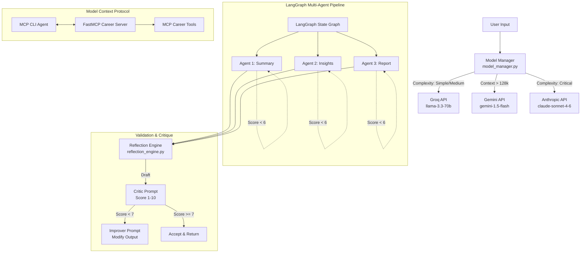

# US Mini Project: LLM Orchestration and Agentic Workflows

This repository contains tools, libraries, and pipelines demonstrating API integration with Groq, Google Gemini, and Anthropic. It covers basic API wrapper scripts, prompt optimization benchmarks, tool-calling agents, state-machine orchestration with LangGraph, and Model Context Protocol (MCP) servers.

---

## Project Purpose

The goal of this project is to implement robust, cost-effective orchestration techniques for large language models. By using dynamic routing, structured JSON inputs, evaluation loops, and state-machine graphs, it provides a reference framework for building production-grade agentic workflows.

---

## Simplified Overview (Guide)

### What this project does (Two Real-World Examples)

**Example 1: The Pizza Shop**
Imagine you own a busy local pizza shop. Every night, your register exports a spreadsheet of sales data (like orders, topping selections, and prices). Instead of a human spending hours calculating profit margins, finding trends, and writing report summaries, this project uses a coordinated team of artificial intelligence agents to analyze the sales data and write professional business reports automatically.

**Example 2: Job Listings and Salaries**
Imagine an HR team analyzing thousands of job postings and salary distributions across various regions. Instead of manually reviewing spreadsheets, the system can ingest the dataset, extract salary trends, identify competitive pay rates, and automatically compile a compensation strategy report.

### How the system works step-by-step
1. **Reading the Data**: The system loads the raw dataset (e.g., pizza sales or job salary spreadsheets), profiles the columns, and generates basic statistics.
2. **Summarizing**: An AI agent reads these statistics and writes a natural language summary of the data.
3. **Extracting Insights**: A second AI agent reviews the summary to find key trends and recommendations (e.g., *"Pepperoni sales double on Fridays"* or *"Software Engineer salaries in New York are 15% higher than the national average"*).
4. **Writing the Report**: A third AI agent takes the summary and insights and formats them into a polished, executive-ready report.
5. **The Critique and Improvement Loop**: At each step, a validator agent reviews the draft, scores it from 1 to 10, and provides feedback. If the score is too low (less than 7), the writing agent edits its work based on the feedback until it meets the quality threshold.

### How the folders connect
The project is built sequentially, with each folder representing a step in developing this automated analysis system:
- **`basic_groq_api/`**: Connection setups to verify the AI link works and perform simple chats or menu summaries.
- **`prompt_techniques_enggineering/`**: Experiments in writing better instructions for the AI, such as role-playing as customer service or thinking step-by-step.
- **`Real_Time_Agents/`**: Giving the AI tools (like calculators for tax calculations and search engines for ingredient costs) so it can fact-check real-world information.
- **`multi-agents/`**: The final pipeline where the individual AI agents are joined together in a state graph to compile automated shop reports.
- **`MCP (Model Context Protocol)/`**: Protocol integrations allowing the shop analysis tools to be accessed directly inside external applications like Claude Desktop.

---

## Roadmap

### Phase 1: API Foundations and Basic Workflows
- Connection verification and test scripts for Groq API.
- CLI conversational chat tool with context length tracking and usage statistics.
- Basic document summarizer managing context limits.

### Phase 2: Prompt Optimization and Evaluation
- System-prompt switching mechanism for multi-persona bots.
- Few-shot learning examples for tone and constraint shaping.
- Chain-of-Thought reasoning loop implementation.
- Automated prompt testing harness to evaluate latency and response quality.

### Phase 3: Tool Use and Function Calling
- Custom function declarations for web search, file systems, and math operations.
- Execution loop logic for function-calling.
- Autonomous research assistant utilizing sequential tool calls to answer questions.

### Phase 4: State-Machine Pipelines and Validation
- Intelligence router with fallback options for async concurrency.
- Self-reflection engine with critique-and-improve editing loops.
- LangGraph state-machine pipeline to profile CSV data, generate insights, and compile Markdown reports.

### Phase 5: Model Context Protocol (MCP) Server
- FastMCP server exposing career analysis and job search functions.
- CLI agent translating local tools to Groq schema definitions.
- Claude Desktop configuration helper for direct desktop application access.

### Phase 6: Web Interface and User Interface
- Migration of terminal utilities to a React / Next.js web application.
- Real-time visualization for LangGraph pipeline states.
- Local SQLite database integration for query and session history.

---

## Architecture & Component Flow



---

## Repository Directory Structure

```text
US_MiniProject/
│
├── model_manager.py                  # Routes API calls dynamically based on task complexity
├── reflection_engine.py              # Self-reflection validation loops (critique/improve)
│
├── basic_groq_api/                   # Phase 1: Connectivity and basic API features
├── prompt_techniques_enggineering/   # Phase 2: System prompts, persona bots, and evaluation
├── Real_Time_Agents/                 # Phase 3: Function calling and tools integration
├── multi-agents/                     # Phase 4: LangGraph orchestration and validation
└── MCP (Model Context Protocol)/    # Phase 5: FastMCP server and desktop tools
```

### The File Breakdown (The Pizza Shop Analogy)

### 1. The Foundations (Setting up the shop)
- **`utils.py` (The Keys to the Store)**: Before any worker can enter the shop, they need the keys. This file securely loads the secret API keys from the configuration file to authenticate connections to the AI models.
- **`setup_check_groq.py` (Testing the Telephone Line)**: This script tests the connection. It calls the AI provider's server to check if the API key works and the connection is active.
- **`chat.py` (Talking to the Cashier)**: A simple chat window. The shop owner can type a basic query and chat with the AI cashier while tracking how many tokens were used.
- **`summarize.py` (Summarizing a Long Menu)**: If there is a long document containing recipe suggestions, this script automatically handles dividing up the long text and summarizes it into a clean, short bulleted list.

### 2. Prompting Experiments (Training the Cashiers)
To make sure the AI answers correctly, we run experiments on how to write instructions (prompts):
- **`summarize_v2.py` (XML Formatting vs Plain Instructions)**: Compares two styles. It shows that putting data inside structural tags yields cleaner, more organized responses compared to writing a wall of text.
- **`persona_bot.py` (Changing Customer Service Roles)**: Tests how the AI acts in different roles (e.g., acting as a Career Coach or a Web Developer) to see how changing the system instructions alters the tone.
- **`persona_bot_v2.py` (Teaching by Example)**: Uses few-shot learning. It feeds the AI examples of how to respond so it mimics the exact customer service tone desired.
- **`chain_of_thought.py` (Thinking Out Loud)**: Forces the AI to write its thought process first inside a thinking tag before giving an answer.
- **`prompt_scroing_upon_techniques.py` (The Quality Tester)**: An automated testing tool. It runs multiple prompts, scores the quality of the answers, and outputs a report showing which prompting method was most accurate.

### 3. Tool Integrations (Giving the Cashier a Calculator & Map)
AI models are bad at math and do not know real-time prices. We give them physical tools to use:
- **`tools.py` (The Calculator & Notepad)**: Declares actual Python functions the AI can use, like a calculator tool to compute taxes, a file reader tool, or a file writer tool.
- **`tools_working.py` (The Tool Loop Demonstration)**: A script that runs a simulation showing exactly how the AI recognizes a problem and calls the calculator function to solve it.
- **`real_search.py` (The Delivery Map)**: Connects the AI to search engines so it can browse the web for real-time information.
- **`research_assistant.py` (The Assistant Manager)**: An autonomous agent. The owner can ask to find the current price of an item and calculate costs. The assistant will search the web, calculate the cost, and write a summary.

### 4. Coordinated Pipelines (The Automated HQ Team)
This is the main state machine where multiple specialized agents are managed by a central graph:
- **`model_manager.py` (The Shift Scheduler)**: Automatically routes jobs. Simple tasks go to fast models, while critical tasks go to more advanced models.
- **`reflection_engine.py` (The Quality Inspector)**: A self-reflection loop. It reviews drafts, scores them, and if the score is low, sends it back to the writer with editing instructions.
- **`orchestrator.py` (The General Manager)**: Uses LangGraph to link everything. It moves the data from step to step: loading data, summarizing, extracting insights, writing the report, and saving. If one step fails quality checks, it retries just that step.
- **`agent1_summarize.py` (The Bookkeeper)**: Reads the raw data file and writes down statistical summaries.
- **`agent2_insights.py` (The Business Strategist)**: Analyzes the summary to find trends.
- **`agent3_report.py` (The Technical Writer)**: Combines everything into a polished, professional markdown report.
- **`validators.py` (The Auditor)**: Ensures the final report format is correct before it is saved.
- **`benchmark.py` (The Cost Auditor)**: Runs the pipeline using free models versus paid models and compares the quality-to-cost ratio.

### 5. Desktop Integrations (Integrating the Cash Register)
- **`mcp_server_career.py` (The Tool Connection Board)**: Exposes these tools over the standard Model Context Protocol so external programs can tap into them.
- **`agent_with_mcp.py` (The External Controller)**: A command-line tool to connect to the server and invoke tools remotely.
- **`claude_desktop_setup.py` (The App Installer)**: Integrates the custom tools directly into desktop applications. The owner can chat with the desktop app and ask it to analyze the shop using the custom tools.
- **`test_mcp_tools.py` (Local Connector Test)**: Validates that the external tools function correctly on the local machine.

---

## Installation

### Prerequisites
- Python 3.10+
- Node.js (Optional, only for Claude Desktop integration)

### Install Dependencies
```bash
pip install groq langgraph langchain-core google-generativeai pandas anthropic mcp
```

### Configuration
Create a `.env` file in the root directory:
```env
GROQ_API_KEY="your_groq_api_key"
GEMINI_API_KEY="your_gemini_api_key"
TAVILY_API_KEY="your_tavily_api_key" # Optional, for web search tool
ANTHROPIC_API_KEY="your_anthropic_key" # Optional, for paid model comparison
```

---

## Usage

### Basic API Workflows
```bash
# Verify API key configuration
python basic_groq_api/setup_check_groq.py

# Launch interactive CLI chat
python basic_groq_api/chat.py
```

### Prompt Engineering and Performance Evaluation
```bash
# Swappable system personas bot
python prompt_techniques_enggineering/persona_bot.py

# Benchmark prompt techniques
python prompt_techniques_enggineering/prompt_scroing_upon_techniques.py --topic career
```

### Tool Use & Research Agent
```bash
# Visual trace of function-calling loop
python Real_Time_Agents/tools_working.py

# Run the research assistant agent
python Real_Time_Agents/research_assistant.py
```

### LangGraph Pipeline Orchestration
```bash
# Execute multi-agent state-machine over a CSV file
python multi-agents/orchestrator.py multi-agents/sample_data.csv

# Run orchestration quality benchmark
python multi-agents/benchmark.py
```

### MCP Tools Setup
```bash
# Launch the FastMCP Server in SSE mode (Terminal 1)
python "MCP (Model Context Protocol)/mcp_server_career.py" --sse

# Launch the MCP CLI Agent (Terminal 2)
python "MCP (Model Context Protocol)/agent_with_mcp.py"

# Configure Claude Desktop settings
python "MCP (Model Context Protocol)/claude_desktop_setup.py"
```
