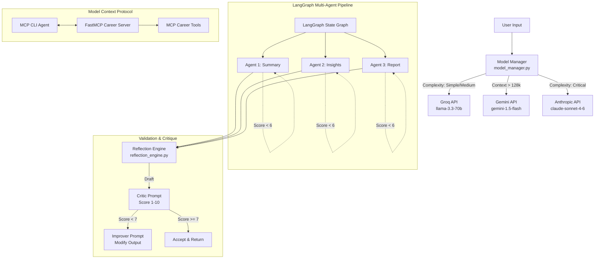

# Groq API Integration and Agentic Workflows

This repository contains tools, libraries, and pipelines demonstrating API integration with Groq, Google Gemini, and Anthropic. It covers basic API wrapper scripts, prompt optimization benchmarks, tool-calling agents, state-machine orchestration with LangGraph, and Model Context Protocol (MCP) servers.

---

## Project Purpose

The goal of this project is to implement robust, cost-effective orchestration techniques for large language models. By using dynamic routing, structured JSON inputs, evaluation loops, and state-machine graphs, it provides a reference framework for building production-grade agentic workflows.

---

## Roadmap

### Phase 1: API Foundations & Basic Workflows (Completed)
- Connection verification and test scripts for Groq API.
- CLI conversational chat tool with context length tracking and usage statistics.
- Basic document summarizer managing context limits.

### Phase 2: Prompt Optimization & Evaluation (Completed)
- System-prompt switching mechanism for multi-persona bots.
- Few-shot learning examples for tone and constraint shaping.
- Chain-of-Thought reasoning loop implementation.
- Automated prompt testing harness to evaluate latency and response quality.

### Phase 3: Tool Use & Function Calling (Completed)
- Custom function declarations for web search, file systems, and math operations.
- Execution loop logic for function-calling.
- Autonomous research assistant utilizing sequential tool calls to answer questions.

### Phase 4: State-Machine Pipelines & Validation (Completed)
- Intelligence router with fallback options for async concurrency.
- Self-reflection engine with critique-and-improve editing loops.
- LangGraph state-machine pipeline to profile CSV data, generate insights, and compile Markdown reports.

### Phase 5: Model Context Protocol (MCP) Server (Completed)
- FastMCP server exposing career analysis and job search functions.
- CLI agent translating local tools to Groq schema definitions.
- Claude Desktop configuration helper for direct desktop application access.

### Phase 6: Web Interface & UI (Planned)
- Migration of terminal utilities to a React / Next.js web application.
- Real-time visualization for LangGraph pipeline states.
- Local SQLite database integration for query and session history.

---

## Architecture & Component Flow



---

## Repository Directory Structure

```
US_MiniProject/
│
├── model_manager.py                  # Routes API calls dynamically based on task complexity
├── reflection_engine.py              # Self-reflection validation loops (critique/improve)
│
├── basic_groq_api/                   # Phase 1: Connectivity and basic API features
│   ├── setup_check_groq.py           # Verifies the Groq API key and client connectivity
│   ├── chat.py                       # CLI chat loop with token count analytics
│   └── summarize.py                  # Context-aware text summarization script
│
├── prompt_techniques_enggineering/   # Phase 2: System prompts, persona bots, and evaluation
│   ├── summarize_v2.py               # Compares plain vs XML structured prompting styles
│   ├── persona_bot.py                # Swappable system personas
│   ├── persona_bot_v2.py             # Shape chatbot response using few-shot learning
│   ├── chain_of_thought.py           # Step-by-step reasoning parser
│   └── prompt_scroing_upon_techniques.py # Evaluation framework for different prompts
│
├── Real_Time_Agents/                 # Phase 3: Function calling and tools integration
│   ├── tools.py                      # Declares function implementations (search, read, write)
│   ├── tools_working.py              # Traces model tool-calling loops step-by-step
│   ├── real_search.py                # Search integrations (DuckDuckGo, Tavily, SerpAPI)
│   └── research_assistant.py         # Sequential function-calling CLI agent
│
├── multi-agents/                     # Phase 4: LangGraph orchestration and validation
│   ├── orchestrator.py               # LangGraph state machine with automatic retries
│   ├── benchmark.py                  # Benchmarking script comparing cost/performance
│   ├── agent1_summarize.py           # Profiles CSV statistics
│   ├── agent2_insights.py            # Generates strategic insights
│   ├── agent3_report.py              # Compiles full Markdown reports
│   └── validators.py                 # Structure validation schemas
│
└── MCP (Model Context Protocol)/    # Phase 5: FastMCP server and desktop tools
    ├── mcp_server_career.py          # FastMCP server with tools for career research
    ├── agent_with_mcp.py             # CLI client interface using local MCP tools
    ├── claude_desktop_setup.py       # Helper script configuring Claude Desktop app config
    └── test_mcp_tools.py             # Validates career tools locally without server
```

---

## Installation

### Prerequisites
- Python 3.10+
- Node.js (Optional, only for Claude Desktop integration)

### Install Dependencies
```bash
pip install groq langgraph langchain-core google-generativeai pandas anthropic mcp
```

### Configuration
Create a `.env` file in the root directory:
```env
GROQ_API_KEY="your_groq_api_key"
GEMINI_API_KEY="your_gemini_api_key"
TAVILY_API_KEY="your_tavily_api_key" # Optional, for web search tool
ANTHROPIC_API_KEY="your_anthropic_key" # Optional, for paid model comparison
```

---

## Usage

### Basic API Workflows
```bash
# Verify API key configuration
python basic_groq_api/setup_check_groq.py

# Launch interactive CLI chat
python basic_groq_api/chat.py
```

### Prompt Engineering and Performance Evaluation
```bash
# Swappable system personas bot
python prompt_techniques_enggineering/persona_bot.py

# Benchmark prompt techniques
python prompt_techniques_enggineering/prompt_scroing_upon_techniques.py --topic career
```

### Tool Use & Research Agent
```bash
# Visual trace of function-calling loop
python Real_Time_Agents/tools_working.py

# Run the research assistant agent
python Real_Time_Agents/research_assistant.py
```

### LangGraph Pipeline Orchestration
```bash
# Execute multi-agent state-machine over a CSV file
python multi-agents/orchestrator.py multi-agents/sample_data.csv

# Run orchestration quality benchmark
python multi-agents/benchmark.py
```

### MCP Tools Setup
```bash
# Launch the FastMCP Server in SSE mode (Terminal 1)
python "MCP (Model Context Protocol)/mcp_server_career.py" --sse

# Launch the MCP CLI Agent (Terminal 2)
python "MCP (Model Context Protocol)/agent_with_mcp.py"

# Configure Claude Desktop settings
python "MCP (Model Context Protocol)/claude_desktop_setup.py"
```
